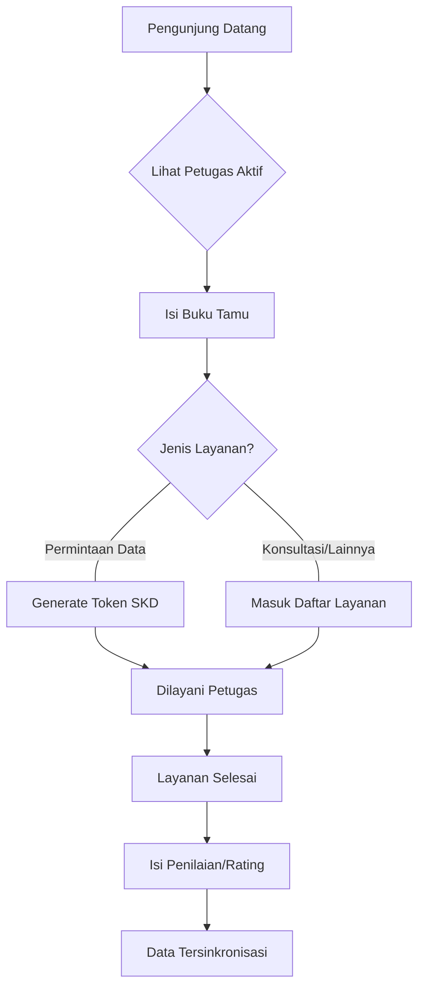

# manual Pengguna: Sistem Front Office BPS 🏢

Dokumen ini menjelaskan fitur-fitur utama dan alur kerja (workflow) dalam aplikasi Front Office BPS untuk memudahkan operasional harian.

---

## 👥 Peran Pengguna (User Roles)

1. **Administrator (Admin)**: Memiliki kendali penuh atas sistem, manajemen pengguna, pengaturan shift, laporan penilaian, dan pemeliharaan database.
2. **Petugas (Front Office)**: Fokus pada pelayanan pengunjung, pemrosesan permintaan layanan, dan pembaruan status layanan secara real-time.
3. **Pengunjung (Publik)**: Mengisi buku tamu, melihat petugas yang sedang bertugas, dan memberikan penilaian layanan.

---

## ✨ Fitur-Fitur Utama

### 1. Buku Tamu Digital (Guest Book)
Memungkinkan pengunjung mencatat kunjungan mereka secara digital. Jika jenis layanan adalah "Permintaan Data", sistem akan otomatis menghasilkan **Token SKD**. Petugas dapat mengakses kembali QR Code rating dan SKD kapan saja melalui menu **Layanan Saya**.

### 2. Manajemen Jadwal & Shift Dinamis
Sistem cerdas yang mengatur siapa petugas yang tampil di layar utama berdasarkan waktu saat ini (WITA).
*   **Adaptif Jumat**: Sistem otomatis mendeteksi hari Jumat dan menggunakan jam pelayanan khusus (menyesuaikan waktu sholat Jumat).
*   **Preview 1 Jam**: Menampilkan shift berikutnya 1 jam sebelum shift saat ini berakhir untuk transisi yang mulus.

### 3. Sinkronisasi Penilaian (GAS Integration)
Fitur canggih untuk menarik data penilaian dari Google Apps Script (Cloud) ke server lokal secara otomatis atau manual. Memberikan kemudahan bagi pengunjung untuk memberikan rating via smartphone/web tanpa mengganggu alur di meja petugas.

### 4. Manajemen Profil BPS
Petugas dapat mengelola profil mereka secara mandiri, termasuk mengganti foto. Tersedia fitur **"Reset ke Foto Official BPS"** yang akan mengunduh otomatis foto resmi pegawai dari portal BPS menggunakan NIP.

### 5. Audit Trail (Log Aktivitas)
Setiap tindakan penting (seperti update profil atau perubahan pengaturan) dicatat dalam sistem log untuk keperluan transparansi dan keamanan data.

### 6. Keamanan Fleksibel
Admin dapat mengatur mode login:
*   **Mode Ketat**: Wajib menggunakan password.
*   **Mode Cepat**: Cukup menggunakan email (cocok untuk lingkungan kantor yang sangat sibuk).

---

## 📑 Alur Proses (Workflows)

### 1. Alur Kunjungan & Pelayanan (Umum)

### 2. Alur Kerja Petugas
1. **Login**: Masuk ke dashboard sesuai hak akses.
2. **Monitoring**: Melihat daftar pengunjung di tab "Layanan".
3. **Eksekusi**: Memperbarui status layanan (Proses -> Selesai).
4. **Resend Rating**: Jika pengunjung lupa mengisi rating saat di meja, petugas dapat mengklik tombol **"Rating"** di daftar layanan untuk menampilkan kembali QR Code atau menyalin linknya.
5. **Validasi**: Memeriksa kelengkapan administrasi (seperti nomor surat atau file pendukung).

### 3. Alur Kerja Administrator
1. **Konfigurasi**: Mengatur jam operasional (Normal vs Jumat).
2. **Penjadwalan**: Mengunggah jadwal petugas secara bulk via Excel atau manual.
3. **Monitoring**: Memantau statistik penilaian dan tren pengunjung melalui grafik interaktif.
4. **Maintenance**: Melakukan backup database berkala dengan satu klik.

---

## 🛡️ Pemeliharaan Sistem
*   **Backup**: Lakukan backup database secara rutin melalui Dashboard Admin.
*   **Sync**: Jika penilaian tidak muncul otomatis, klik tombol "Sinkronkan Sekarang" pada menu Penilaian Admin.

---
*Dokumentasi ini adalah bagian dari sistem Front Office BPS - Versi 1.0*
